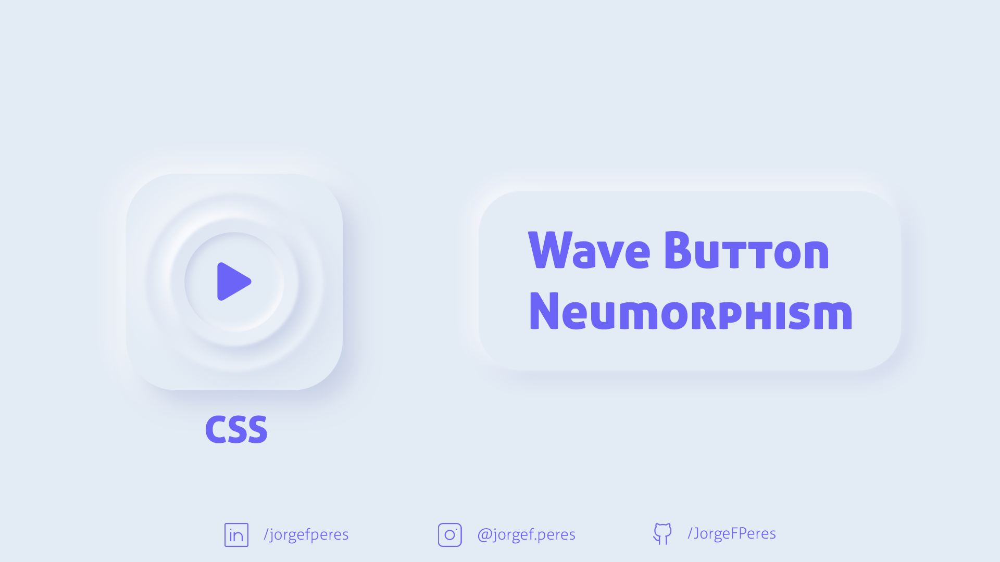

<p align="center">
  <a href="#-technologies">Technologies</a>&nbsp;&nbsp;&nbsp;|&nbsp;&nbsp;&nbsp;
  <a href="#-layout">Getting started</a>&nbsp;&nbsp;&nbsp;|&nbsp;&nbsp;&nbsp;
  <a href="#-project">Project</a>&nbsp;&nbsp;&nbsp;|&nbsp;&nbsp;&nbsp;
  <a href="#-layout">Layout</a>&nbsp;&nbsp;&nbsp;|&nbsp;&nbsp;&nbsp;
  
</p>

<p align="center">
  
  
  

  
</p>

<br>

<p align="center">
  
</p>

---

## 🧪 Technologies

This project was developed using the following technologies:

- CSS, HTML and JS

## 🚀 Getting started

Clone the project and access the folder

```bash
$ git clone https://github.com/JorgeFPeres/Stone_Currency.git  && cd Stone-Currency
```

## 💻 Project

This is a amazing effect play/pause button based on the Neumorphic design concept.


## 🔖 Layout

Credits: Maria M. Muñoz 
- [Dribbble]https://dribbble.com/shots/10725922-Neumorphic-Components.

---

Made with ❤️ by Jorge F Peres
